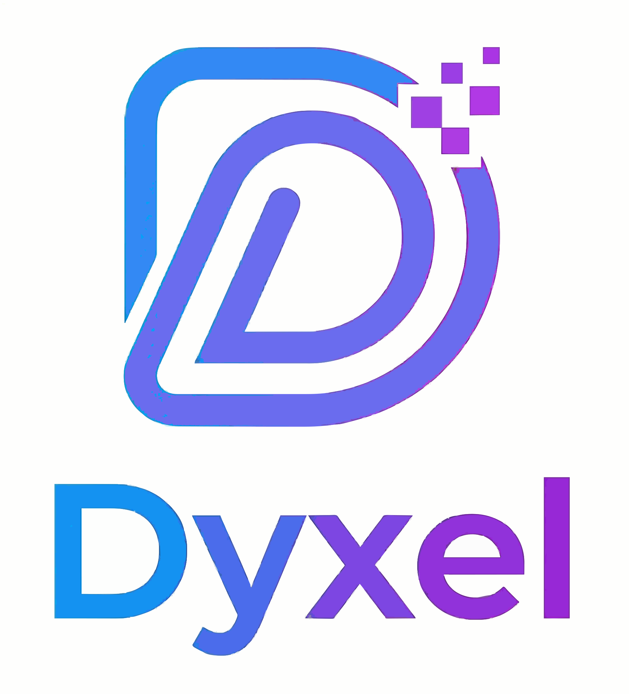

<p align="center">
  
</p>

<h1 align="center">Dyxel</h1>

<p align="center">
  <b>基于 Rust 与 WebAssembly 的跨平台动态化 UI 框架</b>
</p>

<p align="center">
  <a href="../../README.md">🇺🇸 English</a>
  ·
  <a href="#项目概述">项目概述</a>
  ·
  <a href="#架构设计">架构设计</a>
  ·
  <a href="#快速开始">快速开始</a>
</p>

<p align="center">
  <a href="../../LICENSE"></a>
  
  
</p>

---

## 项目概述

**Dyxel** 是一个高性能跨平台 UI 框架，专为构建动态、交互式应用而设计。它利用 Rust 的安全保证和 WebAssembly 的可移植性，在实现动态代码下发的同时提供接近原生的性能。

### 核心理念

- **Host + Guest 架构**: 将渲染引擎（Host）与业务逻辑（Guest）分离，实现最大灵活性
- **零成本抽象**: Rust 驱动的性能，无运行时开销
- **真正的动态更新**: 通过 WASM 部署新 UI 逻辑，无需应用商店更新

---

## 架构设计

```
┌─────────────────────────────────────────────────────────────────┐
│                           应用层                                  │
│  ┌─────────────┐  ┌─────────────┐  ┌─────────────┐             │
│  │   iOS 应用   │  │ Android 应用 │  │   Web 应用   │  ┌────────┐ │
│  │   (Swift)   │  │  (Kotlin)   │  │  (JS/WASM)  │  │ macOS  │ │
│  └──────┬──────┘  └──────┬──────┘  └──────┬──────┘  └────────┘ │
└─────────┼────────────────┼────────────────┼────────────────────┘
          │                │                │
          └────────────────┴────────────────┘
                             │
                    ┌────────▼────────┐
                    │   Dyxel Host    │
                    │    (Rust 核心)   │
                    │    • 渲染        │
                    │    • 布局        │
                    │    • 输入        │
                    └────────┬────────┘
                             │
                    ┌────────▼────────┐
                    │    共享内存      │
                    │    命令缓冲区     │
                    └────────┬────────┘
                             │
                    ┌────────▼────────┐
                    │   Dyxel View    │
                    │   (WASM Guest)  │
                    │    • UI 逻辑     │
                    │    • 动画        │
                    │    • 事件        │
                    └─────────────────┘
```

### 核心组件

| 组件 | 说明 |
|-----------|-------------|
| **dyxel-core** | 宿主引擎，包含平台抽象、渲染协调和 WASM 运行时 |
| **dyxel-render-api** | 渲染后端抽象接口 |
| **dyxel-render-vello** | 基于 Vello 的 GPU 渲染器 (wgpu) |
| **dyxel-render-impeller** | 基于 Impeller 的渲染器（实验性） |
| **dyxel-shared** | 共享类型、协议定义和命令结构 |
| **dyxel-view** | 客户端 UI 框架，支持响应式信号 |

---

## 动态化能力

### 1. 无需应用商店的热更新

业务逻辑编译为 WebAssembly，可动态更新：

```rust
// sample/src/lib.rs - 客户端 UI 代码
#[no_mangle]
pub extern "C" fn guest_tick() {
    let f = FRAME_COUNT.fetch_add(1, Ordering::SeqCst) as f32;
    
    for i in 1..101 {
        let idx = i as f32;
        // 基于时间的动态定位
        let x = 50.0 + (f * 0.03 + idx * 0.5).cos() * 40.0;
        let y = 50.0 + (f * 0.02 + idx * 0.3).sin() * 40.0;
        
        View { id: i }
            .inset((y, 0.0, 0.0, x))
            .color((
                (128.0 + (f * 0.02 + idx).cos() * 127.0) as u32,
                (128.0 + (f * 0.03 + idx * 0.5).sin() * 127.0) as u32,
                (128.0 + (idx * 2.0).cos() * 127.0) as u32
            ));
    }
    
    dyxel_view_tick();
}
```

### 2. 共享内存通信

通过共享缓冲区实现 Host 与 Guest 之间的零拷贝通信：

```rust
// 共享缓冲区布局
pub struct SharedBuffer {
    pub command_len: u32,
    pub max_node_id: u32,
    pub command_data: [u8; MAX_COMMAND_BYTES],  // 来自 Guest 的命令
    pub layout_results: [LayoutResult; MAX_NODES], // 返回给 Guest 的布局结果
    pub dirty_mask: [u8; 32],  // 脏标记追踪
}
```

### 3. 跨平台一致性

相同的业务逻辑在所有平台上运行：

| 平台 | Host 实现 | Guest 支持 |
|----------|---------------------|---------------|
| iOS | UniFFI + Swift 绑定 | ✅ |
| Android | JNI + Kotlin 绑定 | ✅ |
| macOS | Native window + winit | ✅ |
| Web | WASM-bindgen + Canvas | ✅ |

---

## 功能特性

### 渲染

- **Vello 后端**: 通过 wgpu 实现 GPU 加速的 2D 矢量图形
- **Impeller 后端**（实验性）: Flutter 渲染引擎移植到 Rust
- **SPIR-V 着色器缓存**: 预编译着色器加快 Android 启动速度

### 布局

- **Flexbox 布局**: 由 [Taffy](https://github.com/DioxusLabs/taffy) 提供支持
- **响应式设计**: 基于百分比和绝对定位
- **圆角**: 支持圆角矩形

### 响应式

- **信号**: 使用 `futures-signals` 实现细粒度响应式
- **异步支持**: 客户端支持 async/await 用于动画和效果

---

## 快速开始

### 前置要求

- Rust 1.75+，并安装 `wasm32-unknown-unknown` 目标
- Android 开发：Android SDK + NDK
- iOS 开发：Xcode

### 构建与运行

```bash
# macOS
./build_mac.sh

# Android
./build_android.sh
cd android && ./gradlew assembleDebug

# Web
./build_web.sh
cd web && python3 -m http.server 8000
# 打开 http://localhost:8000
```

---

## 项目结构

```
.
├── crates/
│   ├── dyxel-core/          # 宿主引擎核心
│   ├── dyxel-render-api/    # 渲染抽象
│   ├── dyxel-render-vello/  # Vello 渲染器
│   ├── dyxel-render-impeller/ # Impeller 渲染器
│   ├── dyxel-shared/        # 共享类型与协议
│   ├── dyxel-view/          # 客户端 UI 框架
│   └── wasm3/               # WASM3 运行时
├── sample/                  # 示例客户端应用
├── mac/                     # macOS 宿主
├── web/                     # Web 宿主
├── android/                 # Android 宿主
├── docs/
│   └── zh-cn/               # 中文文档
├── assets/                  # Logo 与资源
└── build_*.sh               # 构建脚本
```

---

## 许可证

本项目采用以下双重许可证之一：

- **Apache License, Version 2.0** ([LICENSE-APACHE](../../LICENSE-APACHE) or https://www.apache.org/licenses/LICENSE-2.0)
- **MIT License** ([LICENSE-MIT](../../LICENSE-MIT) or https://opensource.org/licenses/MIT)

由您选择。详见 [LICENSE](../../LICENSE)。

---

## 致谢

- [Vello](https://github.com/linebender/vello) - GPU 加速 2D 图形
- [Taffy](https://github.com/DioxusLabs/taffy) - Flexbox 布局引擎
- [wgpu](https://github.com/gfx-rs/wgpu) - WebGPU 实现
- [wasm3](https://github.com/wasm3/wasm3) - 高性能 WASM 解释器

---

<p align="center">
  <i>构建动态化，快速交付，随处运行。</i>
</p>
